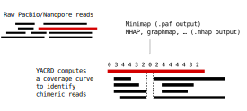

# Yet Another Chimeric Read Detector



yacrd use reads against reads mapping to :
1. compute coverage of each read
2. each region where coverage is minus or equal to `min_coverage` (default 0), yacrd create a gap.
3. if gap are in middle of read, they are mark as `Chimeric`
4. if gap size > 0.8 * read length, they are mark as `Not_cover`

## Mapping Format

Actualy yacrd support only Pairwise Alignement Format.


## Requirements

- CMake >= 2.8


## Building

```
git clone https://github.com/natir/yacrd.git
cd yacrd
mkdir build
cd build
cmake ..
make
```

After building, you can move/copy/add yacrd exectuable binary in your PATH


## Usage

```
usage: yacrd [-h] [-c coverage_min] -i mapping.paf

Options:
        -h                   Print help message
        -c,--min_coverage    If coverage are minus or equal to this create a gap [0]
        -i,--in              Maping input file

```

yacrd write in standard output the id of chimeric read

## Output

```
type_of_read:id_in_mapping_file,length_of_read:length_of_gap,begin_pos_of_gap,end_pos_of_gap;length_of_gap,be…
```

### Example

```
Not_cover:readA,4599;3782,0,3782;
```

readA haven't sufficient coverage, gap have length 3782 base between base 0 to 3782.

```
Chimeric:readB,10452;862,1260,2122;3209,4319,7528;
```

readB are chimeric with 2 gap between bases 1260 to 2122 and 3209 to 7528.
